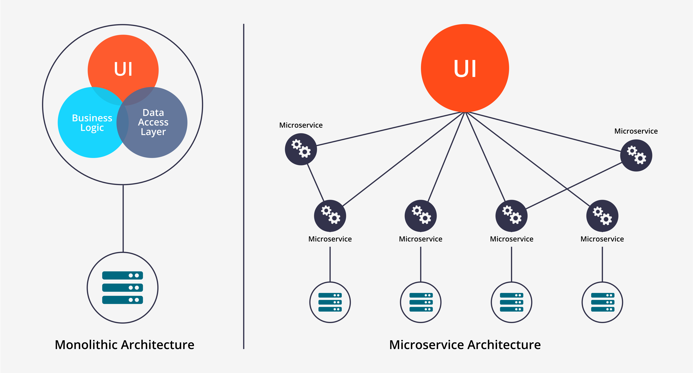
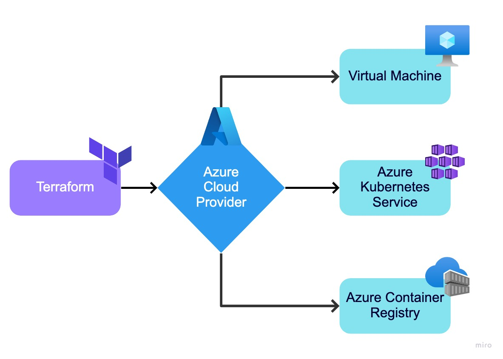
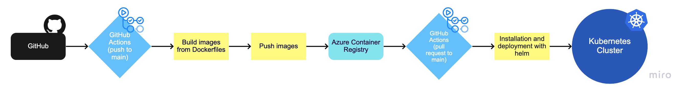
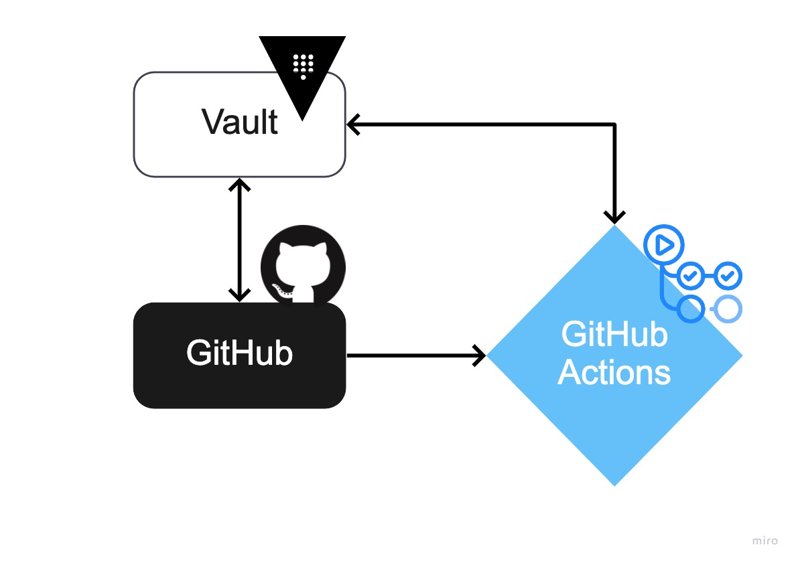
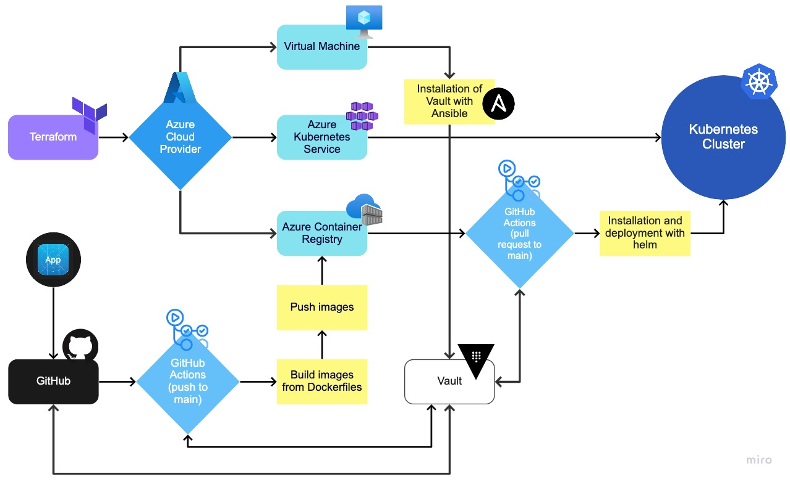

# Final Project

# Online Boutique.

Online Boutique is a web-based e-commerce store, with which you can buy your favorite items easily and quickly!

# Business Proposal

## From Monolith to Microservices:

We have decided to implement the microservices infrastructure for this application due to the flexibility that this application deployment model gives us since it will allow us to execute continuous integration and deployment strategies in a simpler way without affecting the final user experience.

## Kubernetes:

For the management of the microservices of our application, we use Kubernetes, specifically Azure Kubernetes service in a cloud environment (which we will talk about soon).
Applying Kubernetes as one of the solutions allows us advantages such as:

- The ability to automatically drop containers based on your resource requirements, without impacting availability.
- Being able to mix critical and best-effort workloads to increase usage and optimize resources.
- Allow storage orchestration - Automatically mount the storage system with our cloud provider.
- Self-healing: restart the containers that fail and also remove the containers that are not responding and do not publish them until they are ready.

## Cloud:

The previous way of working was based on an on-premise model, we made the decision to work with a cloud environment, this allows us to save costs, both initial and subsequent maintenance, accelerate productivity and the implementation of changes in the application, pay only for the necessary use and allow us to adjust the service and make it grow at any time.

## Azure:

As a provider of cloud services, we opted to work with azure, due to its ease of use, the number of services available, and the benefits offered by its customer service and available documentation. Microsoft provides us with resources like Azure Kubernetes Service (AKS), Azure Container Registry (ACR), etc. Where we can have all the resources in the same environment and it's easier to handle them.

## Infrastructure as Code:

We also decided to use the infrastructure as code through Terraform, a tool for building, changing, and versioning infrastructure safely and efficiently. In this case, it was helpful for automating the creation of the infrastructure resources and to have control of everything that has been built so every change made can be tracked and safely released. In the case of a Disaster Recovery scenario, we can just change of resource group, create a new service principal and build again the infrastructure with the Terraform code, thus allowing us a simpler and faster deployment of the necessary resources for the operation of the application.

## Configuration Management:

To streamline the provisioning process and the configuration management, we implemented Ansible as our tool to perform this task, making use of the above to perform the Vault installation as well as its respective requirements and configurations through a playbook in our virtual machine created. previously with Terraform.

## CI / CD:

Continuous integration and deployment are a fundamental and important part of the DevOps practice applied to this project, we implement this way of working through GitHub and Git Actions, through pipelines, we automate the containerization of each of the application's microservices, building the images with each push in the main branch as long as the specific modification of that Dockerfile is fulfilled, the storage of these in a container registry is achieved through a pull request towards the main branch, and finally, the deployment and installation in our Kubernetes service using Helm, a package manager with which we can provide our cluster in a faster way.

## Security:

To improve the security of our pipeline, and make sure we have control of our secrets, we use Hashicorp Vault, through a Key-Value Storage to safeguard all credentials and secrets used during all our CI / CD workflows, thus ensuring to manage our own credentials and secrets without resorting to exposing them directly in our pipelines or trusting them as GitHub secrets, where the process of safeguarding and handling credentials is not specified.

---

